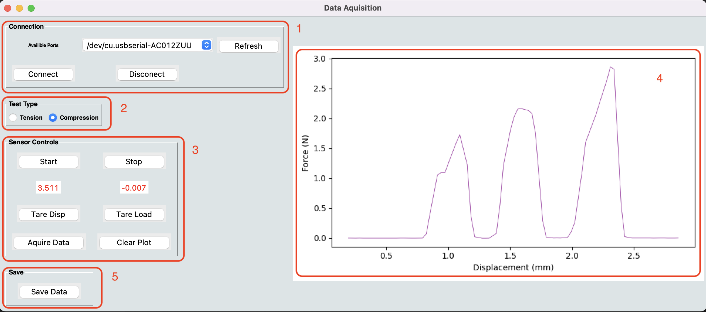

# open_mechanical_testing

Programs created for a the recording of force and displacement simultaneously

## **Introduction**

The ability to measure force and displacement is essential to estimating the mechanical properties of a material, which is a cornerstone of both materials’ science and biomechanics alike. In many instances it is essential to conduct these measurements in the field and this has led to the development of small-scale testing rigs, often termed “portable mechanical testers”. 

However, these rigs are usually highly complex, specialized, and expensive. The objective of this project was to develop a cost-effective alternative to these high-end machines using readily available budget hardware. This is achieved through three main aims 

1.	Development of software to allow a microcontroller to receive force and displacement signals from sensors and send this information via serial to a computer. 

2.	Development of a Calibration GUI, that allows a user to calibrate the raw signal from a load cell, using known weights, to define a calibration allowing accurate and reproducible measurments of force in Newtons. 

3.	Development of a Data Acquisition GUI that allows the user to collect, graph and save data sent from the microcontroller via the serial connection. 

___________________

## **Hardware used in project** 

### **1. ATO Tension and Compression Load Cell,  5kgSKU: ATO-LC-TC01**

This is an in-line foce cell with a capacity of 5kg. it has high acuracy and low creep and importantly it can function using the 5v provided by the microcontoler. 

### **2. SparkFun Load Cell Amplifier - HX71** 

A popular breakout board that amplifies the changes in resistance of the load cell. Its main feature is the HX711 chip which is popular and has had many open source libraries written to allow ease of use. The chip boast a 24bit analog to digital converter and it can provide samples at either 10 or 80Hz. 

### **3. A RS 341-597 Rotory Encoder**
This rotary encoder is used to record rotations of a axel that drives a threaded bar that moves a crosshead up and down a vertical axis. In this way the rotations can be used as a proxy for  the displacment of the croshead. The encoder is highly accurate and has 500 pulses per rotation. 

### **4. Arduino Nano Microcontroller**
Arduino produces open source microcontollers for use in small scale projects like this one. The Arduino Nano is one of the smallest versions that the company makes. At its heart is the ATmega328 chip. It is powered by and sends serial data through a micro USB port. 

_________________

## **Wiring Diagram**
Below is the wiring schematic for the hardware used. 

_________________
## **Program 1 - Signal processing (load_rotary.ino)**

This is a small programme that is uploaded to the Arduino nano and will give instructions to the microcontroller indicating how to handle signals from the sensors, commands from the computer and in what format to send the serial data to the computer. 

The code can be uploaded to the Arduino using the Arduino IDE (https://www.arduino.cc/en/software) and this environment requires that the code is written in C++. 

This code requires two libraries to run. These libraries provide extra functionality when working with the hardware. The two libraries here are open source and allow use and manipulation of their codes, provided through MIT licence. Attributions are displayed in the script. Downloaded libraries can be added directly to the library folder ("Documents > Arduino > libraries"). Alternatively, you can use the libraries manager within the Arduino IDE to add libraries (Sketch > Include Library > Manage Libraries). 

The libraries needed are: 

1. Queuetue HX711 Arduino Library (https://github.com/queuetue/Q2-HX711-Arduino-Library)
2. RotaryEncoder library (https://github.com/mathertel/RotaryEncoder)

The code initially defines the pins for both the load cell and rotary encoder input. It is then necessary to define the variables needed for the rest of the program. 

The setup() function, runs once when the microcontroller is powered up, here the pin interrupts are set up for the rotary encoder. These interrupts are required so that no readings from the rotary encoder are missed when another process is being actioned by the Arduino. 

The loop() function, does just that, it loops continuously as long as the Arduino is powered. Within this loop function there are three distinct functions actioned. 

1. checkSerial(), this functions uses nested if statements to check if there is an incoming command from the serial bus and directs actions based on characters received from the computer via serial. The three commands are: “d” for starting data transmission, “s” for stopping data transition and “w” for tareing the rotary encoder. 

2. encode(), is a small function that checks the position of the rotary encoder and updates the position if different from last reading. It also produces a variable that converts the absolute position of the rotary encoder to a measurement in mm. 

3. sendFormattedData(), is a function that formats the data that is to be sent via serial to the computer.

_______________
## **Program 2 - Load calibration  (calibration_app.py)**
This program is used to calibrate the raw output from the load cell amplifier into Newtons of force. The load cell contains strain gauges where measured electrical resistance varies with a given strain. This means the raw output of the load amplifier will change as a load is applied to it. The numbers outputted from the load cell amplifier are somewhat meaningless but the change in response to a given load is exceptionally linear, meaning that with a series of known weights and basic regression analysis it is relatively easy to calculate a calibration factor which converts the raw output of the load cell out put into Newtons of force. 

The program is built using the object orientated programming with classes for dealing with the serial connection (serial_data()) between the computer and hardware and a class for dealing with the GUI application (app()) and finally a main loop (main()) for the running of GUI. 

The class serial_data() uses the package PySerial which provides the backend for running a serial connection on most popular operating systems. It is also necessary to use the Threading package that runs a background thread that continuously reads the serial buffer and processes the data received into the serial buffer. This is so that we don’t end up data points accumulating in the buffer and effecting downstream processes. 

The class App() relies heavily on TKinter which is a popular python package used to produce GUIs on all popular operating systems. Other packages utilized here are Matplotlib for displaying data, Numpy used for processing and analysing numerical data and the csv package for saving the raw data used to calculated the calibration factor to a csv file. 

The GUI is composed of 4 major functional panels: 

1. This panels deals with connecting, initializing, and disconnecting the serial connection. A drop-down menu allows selection of correct port. If hardware does not appear on the list the refresh button can be used to refresh the list. The connect button connects the hardware and computer. The Initialize button begins the live raw data readout from the load cell (in red text). Disconnect button terminates the serial connection. 

2. This panel is where the user inputs the known weights that will be place on the load cell (left hand column) and the averaged raw data value for a given weight is displayed in red (right hand column). The plot button, plots the data on the graph panel, calculates the linear relationship and displays the calibration factor and r-squared of the fit. 
   
3. Here the user selects the weight that is being placed on the load cell using the radio buttons. The first click of the “Acquire Data” button begins data collection for that particular weight selected at 10hz per second. The user should collect data for circa 10s to ensure an accurate average can be calculated. The second time the “Acquire Data” stops data from being collected. The set button stores the data as a list and calculates an average, displaying it in the panel above (in red). This process should be repeated for all 4 known weights. 
   
4.	This panel offers the user options to clear all data and start the calibration process again (“Clear Data”). An option to save the raw loadcell data readouts for each of the known weights as a .csv file (“Save Data”) and an option to save the calibration factor to a .txt file which can be used by the data acquisition program to insure forces are calibrated correctly (“Save calibration”). 
_______________
## **Program 3 - Data Acquisition (data_acquisition.py)**
This program is used to acquire force and displacement data simultaneously from two different sensors (listed above) during a mechanical test. 

Like calibration_app.py The program is built using the object orientated programming with classes for dealing with the serial connection (serial_data()) between the computer and hardware and a class for dealing with the GUI application (app()) and finally a main loop (main()) for the running of GUI.

The backend architecture of this GUI is quite similar to the calibration app. Major differences are found in the class app() as this contains methods for calibrating raw data into useful numbers, start/stop/acquire data functionality, and displaying the data live on the force/displacement plot (panel 4). 

The GUI is composed of 4 major functional panels:

1. This panels deals with connecting and disconnecting the serial connection. A drop-down menu allows selection of correct port. If hardware does not appear on the list the refresh button can be used to refresh the list. The connect button connects the hardware and computer. Disconnect button terminates the serial connection.

2. Here the user can select if they will be using the force cell to stretch a sample in tension or push down on a sample in compression. 

3. This panel allows for sensor controls. The Start button initializes the live readouts from both sensors (in red text). The stop button ceases data from sensors. Tare buttons zero the readout from the sensors.  Pressing Acquire data begins collection of data from sensors and live plots it on the graph in panel 4. A second hit of the Acquire data button finishes data collection. 

4. The Save button allows the acquired data to be saved as a .csv file. 
